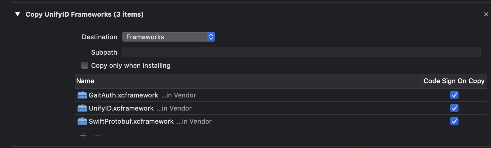

# Prove iOS SDK Reference

## Prerequisites

- Swift `5.1` or greater
- iOS `10.0` or greater
- Xcode `11.6` or greater
- CocoaPods `1.10.0` or greater.

## Next Steps

Follow one of our guides on our [developer portal](https://developer.unify.id/docs/).

## Installation

### CocoaPods

CocoaPods `1.10.0` or greater is now required. In order to support Xcode 12 and up,
the SDK is now packaged as `xcframework` binaries. Only CocoaPods `1.10.0` and greater
have support for this version of Xcode and for `xcframework` files.

To upgrade CocoaPods, update the version in your `Gemfile` and then run `bundle update`

```ruby
gem 'cocoapods', '~> 1.10.0'
```

Or upgrade your system installation of CocoaPods if you do not use Bundler.

```shell
# with sudo if using system ruby
gem install cocoapods
```

### Setting up CocoaPods

Add the UnifyID pod to your app target.

```ruby
platform :ios, '10.0'

target 'MyApp' do
  use_frameworks!
  pod 'UnifyID/GaitAuth'
end
```

### Manual Integration

The Prove SDK is also distributed in the form of XCFramework files which may be directly dragged into your
`xcodeproj` file to link the SDK. This section will guide you through the process of manually integrating
the SDK.

#### Prerequisites

- Xcode 12.0 is required to manually link against binary xcframeworks. This process may work under Xcode 11.X,
  but stability is not guaranteed.
- You must have access to download the latest public release artifacts from the 
  [UnifyID/unifyid-ios-sdk GitHub Repo](https://github.com/UnifyID/unifyid-ios-sdk/releases)

#### Installation

1. Download the Prove framework artifacts into a local vendor folder in your project. All SDK targets will require
   the `Prove-Core` release frameworks (`Prove`, `SwiftProtobuf` & `Clibsodium`) in addition to the frameworks
   provided by a `GaitAuth`/`PushAuth`/`HumanDetect` release.  Unzip the downloaded files to extract the `xcframework`s.

2. Open your Xcode project or workspace and navigate to the "Build Phases" tab of your application target. Expand the "Link Binary with Libraries" section
   and drag the `xcframework` files directly from `Finder` into the window. Assuming the framework files are already in your project folder, you should
   uncheck the "Copy Files" box so the frameworks are added as references to their current location in your project directory. After the frameworks have been added
   they should appear in a new `Frameworks` folder in the project navigator in your left sidebar as well as in the build phases section.

    <div align="center"></div>

3. Still on the "Build Phases" tab, click the `+` icon in the top left to add a new build phase. Choose the `New Copy Files Phase` option and
   select `Frameworks` as the destination. As the Prove SDK is split into multiple frameworks, the dynamic frameworks need to be copied
   into the application bundle so that they appear in the framework search path at runtime. In this section, you just need to include the
   Prove module you are using (`Prove`, `GaitAuth`, `PushAuth` or `HumanDetect`) as well as `SwiftProtobuf`.

    <div align="center"></div>
    <div align="center"></div>

4. At the end, your build phases window should look like the following:

    <div align="center"></div>

5. Add a custom build setting in your `xcconfig` file to disable unsupported architectures. The following setting means that
   the project cannot be run in the iOS Simulator on 32 bit Macs or Arm-based Apple Silicon Macs. The latter is on our roadmap
   to support, but is not working at present. Please file a GitHub issue if this will block your workflow.

    ```
    EXCLUDED_ARCHS[sdk=iphonesimulator*] = i386 arm64
    ```

    See [this article](https://nshipster.com/xcconfig) on xcconfig files and [this site](https://xcodebuildsettings.com/#excluded_archs)
    on Xcode build settings for more information.
